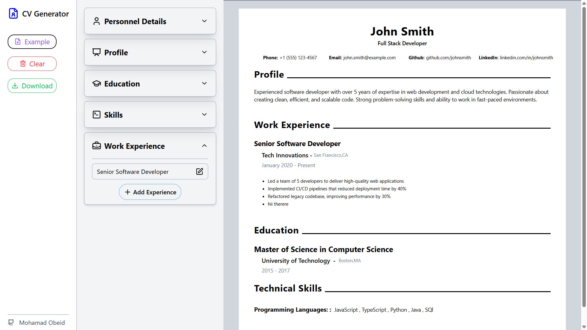

# CV Generator

A modern and customizable CV Generator built with React. This app allows users to dynamically fill out their personal, education, and work details, preview a professional CV in real-time, and download it as a PDF.

## Links

Live Site URL: [Generate Your CV Here 💼📄](https://cv-application-five-beta.vercel.app/)

### The Final Output

## Features

- **Live preview** of CV while editing.
- **Editable sections**: Personal Details, Education, and Experience.
- **Download CV** as a professionally formatted PDF.
- **Example CV** loaded by default or with one click.
- **Clear all data** to start fresh anytime.
- **Clean and user-friendly interface**.
- **Responsive Design** works well on all screen sizes.

## Technologies Used

- React
- HTML & tailwind css
- JavaScript (ES6+)
- Lucide-React for icons

## How to Use

1. Enter your personal details, education, and experience in the left panel.
2. Preview your CV in real-time on the right.
3. Click on **Download** to get a PDF copy of your CV.
4. Use **Example** to load a sample CV, or **Clear** to reset everything.
